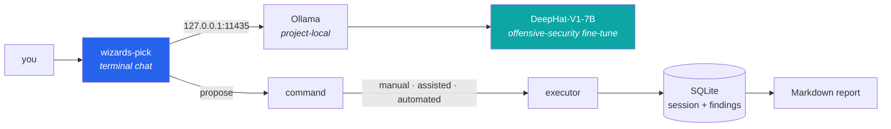

<div align="center">

# wizards-pick

**Your local-first lockpick for authorized security testing. An offensive-security model runs on your machine; nothing leaves it.**

[](LICENSE)
[](#how-it-works)
[](#the-model)
[](#privacy-model)

</div>

---

> ### ⚠️ Authorized use only
> This tool proposes and, in its higher modes, runs security-testing commands. Use it **only**
> against systems you own or have explicit written permission to test. You are responsible for
> staying inside your authorization, scope, and testing window. It ships with **no scope matcher,
> no denylist, and no output redaction** — those guardrails are yours to bring. See
> [Lean by design](#lean-by-design).

## Why local-first

An AI pentest helper is worthless if using it means shipping your recon, your target names, and your
command output to someone else's servers. So this one doesn't. The model runs on your machine
through a **project-local** Ollama server on loopback, the session lives in a local SQLite file, and
there are no remote endpoints and no API keys anywhere in the app. What you test stays on the box you
test from.

## How it works



The model proposes pentest-aware commands for the phase you're in. Depending on the execution mode
you run them yourself and paste output back, confirm each one, or let it run them directly. Every
command and finding is captured to SQLite and exports to a Markdown report.

## The model

`deephat` is **DeepHat-V1-7B**, an offensive-security fine-tune of Qwen2.5-Coder-7B, built locally
from an in-repo Modelfile. It ships as the near-lossless **Q8_0** quant (~8.1 GB) and pins the
model's full **32K native context** with an **f16 KV cache** for maximum precision — the whole thing
still fits a **16 GB GPU** (~8.1 GB weights + ~1.8 GB KV) with `OLLAMA_FLASH_ATTENTION=1`. Sampling
is tuned for command fidelity (low temperature, gentle repeat penalty). 32K is the base model's
trained ceiling; the Modelfile documents an optional rope-scaling block to experiment past it.

Every request is **budgeted to that window** so long engagements never overflow it: the system
framing and your latest turn are always kept, recent history fills the remaining space, and a
single oversized message (a huge scan dump) is trimmed head-and-tail instead of silently pushing
the conversation out of context. Tune it with `WIZARDS_PICK_CONTEXT_TOKENS` if you rebuild the model
with a different `num_ctx`.

## Install

```bash
python3 -m venv .venv && source .venv/bin/activate    # Linux / Kali / WSL
python -m pip install -e .
```

<details><summary>Windows PowerShell</summary>

```powershell
python -m venv .venv
.\.venv\Scripts\Activate.ps1
python -m pip install -e .
```
</details>

## Set up the local model

```bash
# Terminal 1 — start the project-local Ollama server
scripts/ollama-local.sh serve

# Terminal 2 — build the deephat model into this repo
scripts/ollama-local.sh build
```

`build` downloads a Q8_0 GGUF of DeepHat-V1-7B into `.wizards-pick/ollama/gguf/` and creates the
`deephat` model in the project-local store (defaults to the
[mradermacher](https://huggingface.co/mradermacher/DeepHat-V1-7B-GGUF) Q8_0 quant; override with
`DEEPHAT_GGUF_URL` / `DEEPHAT_GGUF_SHA256` for a smaller quant/mirror). No `ollama` on PATH?
`scripts/ollama-local.sh install` vendors one into `.wizards-pick/runtime/` without touching
system paths.

## Run

```bash
wizards-pick
```

First run walks a short context wizard: targets, target type, allowed test categories, optional
exclusions, testing window, authorization reference, intensity, and notes. The scope you set is what
the model plans against.

## Execution modes

| Mode | Behavior |
|---|---|
| `manual` | **Default.** The model proposes; you run commands externally and paste output back. Nothing executes on its own. |
| `assisted` | Proposed commands require a single confirmation before running. |
| `automated` | Proposed commands run directly after parsing. Use only where you are fully authorized. |

Switch anytime with `/mode manual|assisted|automated`.

## Commands

| Command | Does |
|---|---|
| `/context` · `/scope` | Print the session scope |
| `/plan [phase\|all]` | Offline assessment plan for the current scope |
| `/tools` | Check which common local assessment tools are installed |
| `/exec <cmd>` | Run a local command and store the output |
| `/paste` | Paste command output until a line with only `EOF` |
| `/findings` | List stored findings |
| `/report [path]` | Export a Markdown report |
| `/sessions` | List saved sessions |
| `/timeout [secs]` | Show or set the command timeout |
| `/help` · `/exit` | Help · quit |

## Privacy model

Everything runtime lives **inside the repo** under `.wizards-pick/` — session SQLite, reports,
the Ollama model store, and all runtime state. The app deliberately does **not** touch
`~/.wizards-pick`, `~/.ollama`, `/root/.ollama`, or the default Ollama `localhost:11434` store, so
it never collides with or leaks into a system Ollama install. The only network it uses is loopback to
its own server.

## Lean by design

This is a focused tool, not a framework. On purpose, it has:

- no built-in scope matcher
- no output redaction layer
- no command denylist
- no remote LLM endpoints or API keys

Execution is governed entirely by the mode you choose. Bring your own operational guardrails,
authorization workflow, and target restrictions.

## Development

```bash
python -m pip install -e ".[dev]"   # app + pytest, ruff, mypy
make check                          # ruff lint + format check + mypy + pytest
```

Or run the gates individually: `make test`, `make lint`, `make format`, `make typecheck`. The same
checks run in CI on every push and pull request. The test suite is fully offline — it never needs
the model or the network.

---

<div align="center">
<sub>Built by <a href="https://isaaclimb.com">Isaac Limb</a> · <a href="https://isaaclimb.com/projects/penetration-llm.html">Project writeup</a></sub>
</div>
