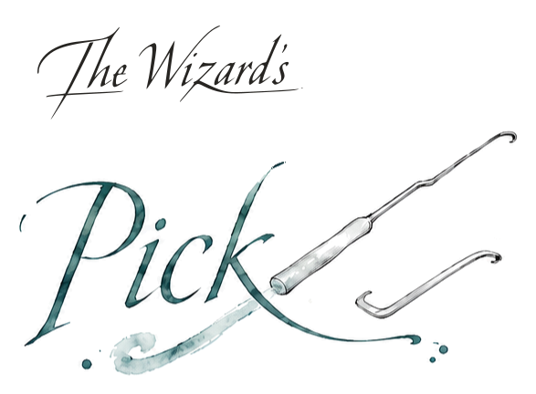
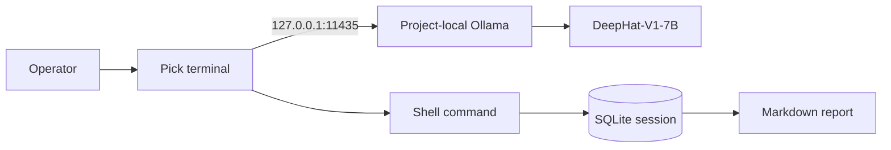

<h1>
  <picture>
    <source media="(prefers-color-scheme: dark)" srcset="docs/assets/pick-logo-dark.svg">
    
  </picture>
</h1>

A terminal assistant for authorized security testing, with local inference by default.

**Status: Working, public.** Version 0.2.0 is the current release.

[](https://github.com/wizards-ecosystem/wizards-pick/actions/workflows/ci.yml)
[](https://github.com/wizards-ecosystem/wizards-pick/blob/main/pyproject.toml)
[](https://github.com/wizards-ecosystem/wizards-pick/blob/main/LICENSE)


> [!WARNING]
> Pick proposes and can execute shell commands. Use it only on systems you own or have
> explicit written permission to test. You are responsible for the authorized targets,
> techniques, testing window, credentials, data handling, and operating environment.

## What The Wizard's Pick does

Pick keeps assessment context, model conversation, command results, findings, and reports in a
local SQLite-backed workflow. It uses an OpenAI-compatible model endpoint, configured by default
for a project-local Ollama server at `127.0.0.1:11435`.



The model can return structured command proposals and findings. Pick records commands executed
through the application and exports all recorded command and audit entries for a session, with
bounded output excerpts.

## Execution model

Pick is intentionally lean. It does not include a scope matcher, command denylist, sandbox,
approval service, or output redaction. Commands are passed to the host shell as written. Operators
who need those controls should provide them through the account, container, virtual machine,
network, and engagement process used to run Pick.

| Mode | Behavior |
|---|---|
| `manual` | Default. The model proposes commands; the operator runs them elsewhere and can paste the output back. |
| `assisted` | Pick asks once before executing a proposal. |
| `automated` | Pick executes parsed model proposals without confirmation, including proposals influenced by captured target output. |

`/exec` always executes the supplied command, independent of the current mode. The default
wall-clock timeout is 300 seconds, and combined captured output is limited to 1,000,000 bytes. Pick
terminates the POSIX process group when either bound is reached. These resource bounds do not
inspect or rewrite the command.

## Requirements

- Python 3.11 or newer
- Linux or WSL2 for the bundled model setup script
- x86-64 for the pinned Ollama archive
- `curl`, `tar`, and `sha256sum`
- approximately 20 GB of free storage for the runtime, downloaded GGUF, and imported model

The Python client may work on other platforms when you manage a compatible endpoint yourself. The
repository's end-to-end setup and CI target Linux.

## Install

Install the CLI from PyPI:

```bash
python -m pip install wizards-pick
```

A source checkout includes the project-local Ollama and model setup scripts:

```bash
git clone https://github.com/wizards-ecosystem/wizards-pick.git
cd wizards-pick
python3 -m venv .venv
source .venv/bin/activate
python -m pip install -e .
```

See the [release checklist](https://github.com/wizards-ecosystem/wizards-pick/blob/main/RELEASING.md)
for maintainer steps.

## Set up the model

In the first terminal:

```bash
scripts/ollama-local.sh install
scripts/ollama-local.sh serve
```

In a second terminal:

```bash
scripts/ollama-local.sh build
```

`build` downloads DeepHat-V1-7B Q8_0 from a pinned Hugging Face revision, verifies its SHA-256
digest, and creates the `deephat` Ollama model in `.wizards-pick/`. To use another GGUF, set both
`DEEPHAT_GGUF_URL` and `DEEPHAT_GGUF_SHA256`.

The application code is MIT-licensed. The default model repository identifies the model license as
Apache-2.0. Review the model card and license before redistribution:
[mradermacher/DeepHat-V1-7B-GGUF](https://huggingface.co/mradermacher/DeepHat-V1-7B-GGUF).

`scripts/bake_rope.py` can write experimental YaRN metadata for larger context windows. Install the
optional dependency with `python -m pip install -e ".[rope]"` and evaluate the resulting model for
your workload.

## Run The Wizard's Pick

```bash
wizards-pick
```

The first session wizard records targets and context, focus areas, exclusions, testing window,
authorization reference, intensity, emergency contact, and notes. This information guides the
model. Pick does not enforce it against generated commands.

## Interactive commands

| Command | Behavior |
|---|---|
| `/context`, `/scope` | Show the session context |
| `/sessions` | List saved sessions |
| `/plan [phase\|all]` | Show an offline assessment plan |
| `/tools` | Check common assessment tools on `PATH` |
| `/mode manual\|assisted\|automated` | Change execution mode |
| `/timeout [seconds]` | Show or set the positive command timeout |
| `/exec <command>` | Execute a shell command and record the result |
| `/paste` | Paste external output, ending with a line containing only `EOF` |
| `/findings` | List recorded findings |
| `/report [path]` | Export a Markdown report |
| `/help`, `/exit` | Show help or quit |

## Data and network behavior

By default, CLI state is written to `.wizards-pick/` under the directory where Pick starts. Set
`WIZARDS_PICK_DATA_DIR` to choose another location. The setup script keeps its Ollama runtime,
model, cache, home, and logs in the repository's `.wizards-pick/` directory.

State directories are created with owner-only permissions on POSIX systems. SQLite files and
reports are written with mode `0600`. Reports and command history are unredacted and may contain
sensitive assessment data.

Inference uses loopback by default. The setup commands download Ollama and the model, and executed
assessment commands can use the network. `WIZARDS_PICK_URL` can point the client at another
OpenAI-compatible endpoint, but Pick does not add authentication headers. A remote endpoint
receives session context and conversation content.

Related settings:

| Variable | Default |
|---|---|
| `WIZARDS_PICK_DATA_DIR` | `<current directory>/.wizards-pick` |
| `WIZARDS_PICK_MODEL` | `deephat` |
| `WIZARDS_PICK_OLLAMA_HOST` | `127.0.0.1:11435` |
| `WIZARDS_PICK_URL` | `http://127.0.0.1:11435/v1/chat/completions` |
| `WIZARDS_PICK_CONTEXT_TOKENS` | `32768` |
| `WIZARDS_PICK_RESPONSE_TOKENS` | `2048` |

## Development

```bash
python -m pip install -e ".[dev]"
make check
make release-check
```

`make check` runs Ruff, mypy, and pytest. The test suite does not require a model server or network
access. See the
[contribution guide](https://github.com/wizards-ecosystem/wizards-pick/blob/main/CONTRIBUTING.md)
and [security policy](https://github.com/wizards-ecosystem/wizards-pick/security/policy).

<div align="center">
<sub>Maintained by <a href="https://isaaclimb.com">Isaac Limb</a>. Read the <a href="https://isaaclimb.com/projects/penetration-llm.html">project writeup</a>.</sub>
</div>
